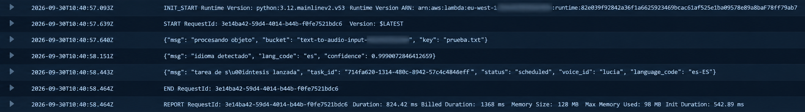
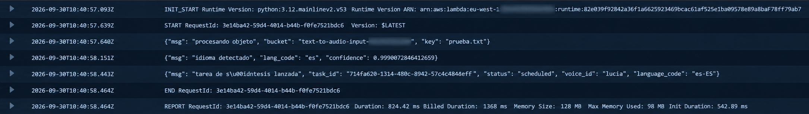
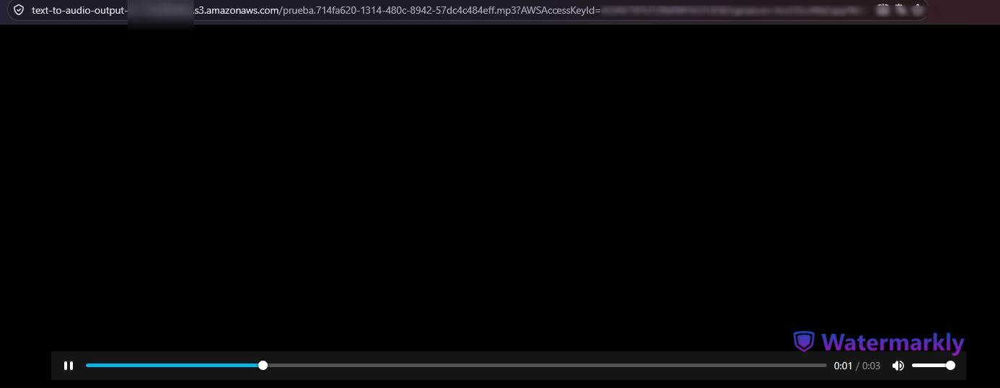
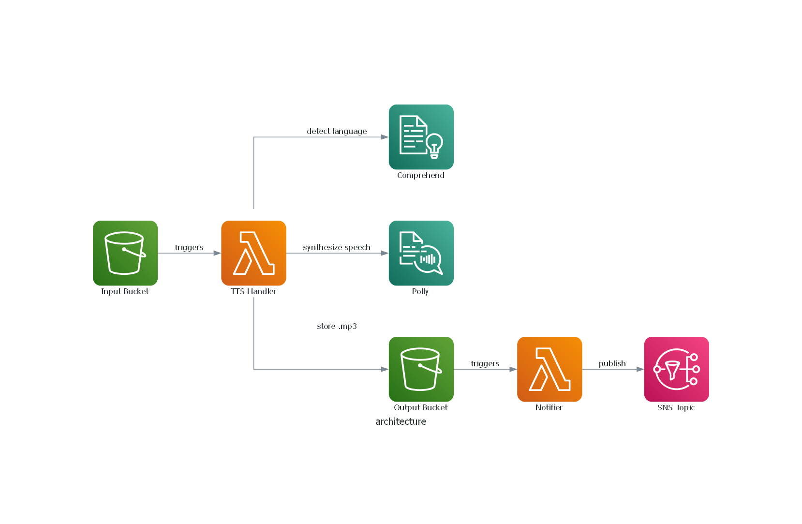

# text-to-audio-polly

> ⚠️ **Demo language / Idioma de la demo:** The demo video below was recorded in Spanish, using Amazon Polly's "Lucia" voice. The pipeline itself is language-agnostic — see [Language Detection](#language-detection--detección-de-idioma).
>
> El vídeo de demostración está grabado en español, usando la voz "Lucía" de Amazon Polly. El pipeline en sí es independiente del idioma — ver [Detección de idioma](#language-detection--detección-de-idioma).

---

## Demo

**1. Upload the .txt file to the input bucket**


**2. Lambda processes the file — language detection and audio synthesis**


**3. Email notification via SNS**


**4. Audio file ready to play**


---

## English

### Overview

`text-to-audio-polly` is an event-driven, serverless pipeline that converts text files into natural-sounding speech. A user uploads a `.txt` file to an S3 bucket; this triggers a Lambda function that detects the text's language with **Amazon Comprehend**, synthesizes audio with **Amazon Polly** using a matching voice, stores the resulting MP3 in a destination S3 bucket, and notifies the user by email via **Amazon SNS**.

The project was built as a portfolio piece to demonstrate asynchronous, event-driven architecture and integration with AWS AI services, using Terraform organized into reusable modules rather than a single monolithic configuration.

### Architecture



**Flow:**
1. A `.txt` file is uploaded to the input S3 bucket.
2. The upload triggers the **TTS handler Lambda**.
3. The handler calls **Amazon Comprehend** to detect the dominant language of the text.
4. Based on the detected language (with a fallback to Spanish if confidence is low or the language isn't supported), the handler selects a matching **Polly** voice and synthesizes the audio.
5. The resulting MP3 is stored in the output S3 bucket.
6. The upload to the output bucket triggers the **notifier Lambda**, which publishes to **SNS** and emails the user a link to the generated audio file.

> Diagram generated with [mingrammer/diagrams](https://github.com/mingrammer/diagrams) — see `docs/diagram.py`. Regenerate with `python docs/diagram.py` after installing Graphviz and `pip install -r docs/requirements-diagram.txt`.

### Language Detection

The handler doesn't assume a fixed language. It uses Amazon Comprehend to detect the dominant language of each uploaded text, then picks an appropriate Polly voice for that language automatically. If Comprehend's confidence is too low, or the detected language isn't supported by Polly, the handler falls back to Spanish (voice: Lucia).

### Tech Stack

| Layer | Service |
|---|---|
| Storage | Amazon S3 (input & output buckets) |
| Compute | AWS Lambda (Python) |
| Language detection | Amazon Comprehend |
| Text-to-speech | Amazon Polly |
| Notifications | Amazon SNS |
| Infrastructure as Code | Terraform (modular: `modules/` + `environments/`) |
| State backend | S3 with native locking (no DynamoDB) |
| Identity | Least-privilege IAM (customer-managed policy) |
| Region | `eu-west-1` |

### Project Structure

```
text-to-audio-polly/
├── terraform/
│   ├── bootstrap/              # tfstate bucket + native S3 locking backend
│   ├── modules/
│   │   ├── storage/             # S3 buckets
│   │   ├── notifications/       # SNS topic + subscriptions
│   │   ├── tts-pipeline/        # TTS Lambda, permissions, triggers
│   │   └── notifier/            # Notifier Lambda
│   └── environments/
│       └── dev/
├── src/
│   ├── lambda_handler/
│   │   └── handler.py           # Comprehend + Polly logic
│   └── notifier_handler/
│       └── handler.py           # SNS → email notification
└── docs/
    └── iam-policy.json          # Least-privilege IAM policy (with placeholders)
```

### Deployment

```bash
# 1. Bootstrap the remote state backend (one-time)
cd terraform/bootstrap
terraform init
terraform apply

# 2. Deploy the environment
cd ../environments/dev
terraform init
terraform apply
```

> Requires an AWS account with credentials configured, and an IAM user/role with sufficient permissions (see `docs/iam-policy.json` for the least-privilege policy used in this project).

### CI/CD Setup

This repo includes a GitHub Actions workflow (`.github/workflows/terraform.yml`) that runs `terraform plan` on pull requests targeting `terraform/**` and `terraform apply` on merges to `main`, using OIDC (no static AWS credentials stored in GitHub).

To reuse this pipeline in your own fork, configure the following **repository secrets** (Settings → Secrets and variables → Actions):

| Secret | Purpose |
|---|---|
| `AWS_ROLE_ARN` | ARN of the IAM role GitHub Actions assumes via OIDC. This role must be created **before** the pipeline can run — deploy the `github-oidc` Terraform module manually once (or via a bootstrap run with local credentials) to create it. |
| `TFVARS_CONTENT` | Full contents of your `terraform.tfvars` file (see `terraform/environments/dev/terraform.tfvars.example`), pasted as a multi-line secret. The workflow writes it to disk at runtime via a heredoc, so no manual escaping is needed — just paste the file as-is. |
| `TF_VAR_IAM_POLICY_NAME` | Name for the least-privilege IAM policy created by Terraform (see `docs/iam-policy.json`). |
| `TFSTATE_BUCKET_NAME` | Name of the S3 bucket holding remote Terraform state (the `bootstrap` module's output). Used to configure the backend without hardcoding it in `.tf` files. |
> ⚠️ The OIDC role (`AWS_ROLE_ARN`) is a chicken-and-egg dependency: it must exist before Actions can assume it, so it can't be created by the same pipeline it authenticates. Create it once via a local `terraform apply` of the `github-oidc` module, then switch to the pipeline for everything else.

### Cost Estimate

Approximate costs assuming light, portfolio-level usage (a handful of short text files per day), all within the `eu-west-1` region. Actual costs will vary with usage volume and text length.

| Service | Pricing basis | Estimated monthly cost (light use) |
|---|---|---|
| S3 (storage + requests) | ~1 GB stored, low request volume | < $0.05 |
| Lambda (2 functions) | Well within the AWS Free Tier (1M requests/month) | $0.00 |
| Amazon Comprehend | ~$0.0001 per unit (100 chars) of text analyzed | < $0.10 for light use |
| Amazon Polly | Standard voices: $4.00 per 1M characters (Free Tier: 5M chars/month for 12 months) | $0.00–$1.00 |
| Amazon SNS | First 1,000 email notifications/month free | $0.00 |
| **Total (light use, within Free Tier)** | | **≈ $0.00 – $1.00 / month** |

> Note: this is an illustrative estimate, not a guarantee. Use the [AWS Pricing Calculator](https://calculator.aws) for a precise projection based on your expected volume.

## Español

### Descripción general

`text-to-audio-polly` es un pipeline serverless y orientado a eventos que convierte archivos de texto en audio con voz natural. El usuario sube un archivo `.txt` a un bucket de S3; esto dispara una función Lambda que detecta el idioma del texto con **Amazon Comprehend**, sintetiza el audio con **Amazon Polly** usando una voz acorde a ese idioma, guarda el MP3 resultante en un bucket de S3 de destino, y notifica al usuario por correo mediante **Amazon SNS**.

El proyecto se construyó como pieza de portfolio para demostrar arquitecturas asíncronas y orientadas a eventos, e integración con servicios de IA de AWS, usando Terraform organizado en módulos reutilizables en lugar de una configuración monolítica.

### Arquitectura


**Flujo:**
1. Se sube un archivo `.txt` al bucket de entrada de S3.
2. La subida dispara la **Lambda del handler de TTS**.
3. El handler llama a **Amazon Comprehend** para detectar el idioma dominante del texto.
4. Según el idioma detectado (con fallback a español si la confianza es baja o el idioma no está soportado), el handler elige una voz de **Polly** acorde y sintetiza el audio.
5. El MP3 resultante se guarda en el bucket de salida de S3.
6. La subida al bucket de salida dispara la **Lambda notificadora**, que publica en **SNS** y envía al usuario un correo con el enlace al audio generado.

> Diagrama generado con [mingrammer/diagrams](https://github.com/mingrammer/diagrams) — ver `docs/diagram.py`. Regenéralo con `python docs/diagram.py` tras instalar Graphviz y `pip install -r docs/requirements-diagram.txt`.

### Detección de idioma

El handler no asume un idioma fijo. Usa Amazon Comprehend para detectar el idioma dominante de cada texto subido, y elige automáticamente una voz de Polly adecuada a ese idioma. Si la confianza de Comprehend es demasiado baja, o el idioma detectado no está soportado por Polly, el handler recurre a español (voz Lucia) como fallback.

### Stack tecnológico

Ver la tabla en la sección en inglés (idéntica).

### Estructura del proyecto

Ver el árbol de directorios en la sección en inglés (idéntico).

### Despliegue

```bash
# 1. Bootstrap del backend de estado remoto (una sola vez)
cd terraform/bootstrap
terraform init
terraform apply

# 2. Desplegar el entorno
cd ../environments/dev
terraform init
terraform apply
```

> Requiere una cuenta de AWS con credenciales configuradas, y un usuario/rol IAM con permisos suficientes (ver `docs/iam-policy.json` para la política de mínimo privilegio usada en este proyecto).

### Configuración de CI/CD

Este repo incluye un workflow de GitHub Actions (`.github/workflows/terraform.yml`) que ejecuta `terraform plan` en los pull requests que afecten a `terraform/**` y `terraform apply` al fusionar a `main`, usando OIDC (sin credenciales estáticas de AWS guardadas en GitHub).

Para reutilizar este pipeline en tu propio fork, configura los siguientes **secrets del repositorio** (Settings → Secrets and variables → Actions):

| Secret | Propósito |
|---|---|
| `AWS_ROLE_ARN` | ARN del rol IAM que GitHub Actions asume vía OIDC. Este rol debe existir **antes** de que el pipeline pueda correr — despliega el módulo Terraform `github-oidc` manualmente una vez (o con un `apply` inicial usando credenciales locales) para crearlo. |
| `TFVARS_CONTENT` | Contenido completo de tu archivo `terraform.tfvars` (ver `terraform/environments/dev/terraform.tfvars.example`), pegado como secret multilínea. El workflow lo vuelca a disco en tiempo de ejecución con un heredoc, así que no hace falta escapar nada manualmente — pega el archivo tal cual. |
| `TF_VAR_IAM_POLICY_NAME` | Nombre para la política IAM de mínimo privilegio que crea Terraform (ver `docs/iam-policy.json`). |
| `TFSTATE_BUCKET_NAME` | Nombre del bucket S3 que guarda el state remoto de Terraform (el output del módulo `bootstrap`). Se usa para configurar el backend sin hardcodearlo en los `.tf`. |
> ⚠️ El rol OIDC (`AWS_ROLE_ARN`) tiene una dependencia de huevo y gallina: debe existir antes de que Actions pueda asumirlo, así que no puede crearlo el propio pipeline al que autentica. Créalo una vez con un `terraform apply` local del módulo `github-oidc`, y a partir de ahí usa el pipeline para todo lo demás.

### Estimación de coste

Coste aproximado asumiendo un uso ligero, de nivel portfolio (unos pocos archivos de texto cortos al día), todo dentro de la región `eu-west-1`. El coste real variará según el volumen de uso y la longitud de los textos.

| Servicio | Base de precio | Coste mensual estimado (uso ligero) |
|---|---|---|
| S3 (almacenamiento + peticiones) | ~1 GB almacenado, pocas peticiones | < $0,05 |
| Lambda (2 funciones) | Dentro de la capa gratuita (1M peticiones/mes) | $0,00 |
| Amazon Comprehend | ~$0,0001 por unidad (100 caracteres) analizada | < $0,10 en uso ligero |
| Amazon Polly | Voces estándar: $4,00 por 1M de caracteres (capa gratuita: 5M caracteres/mes durante 12 meses) | $0,00–$1,00 |
| Amazon SNS | Primeras 1.000 notificaciones por email al mes, gratis | $0,00 |
| **Total (uso ligero, dentro de la capa gratuita)** | | **≈ $0,00 – $1,00 / mes** |

> Nota: esta es una estimación ilustrativa, no una garantía. Usa la [calculadora de precios de AWS](https://calculator.aws) para una proyección precisa según tu volumen esperado.